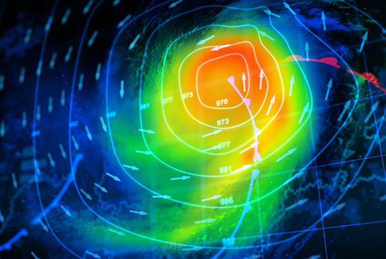
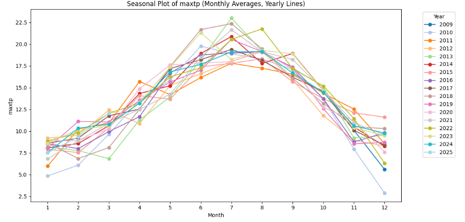
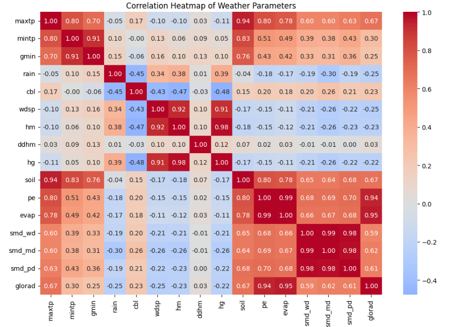
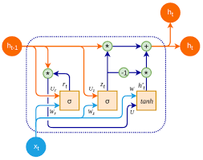

# Weather-Forecasting

Weather forecasting aims to predict atmospheric conditions such as temperature, precipitation, wind, and humidity over a given time horizon by analyzing historical and real-time meteorological data. Modern forecasting systems combine physical models with data-driven approaches, leveraging machine learning to capture complex spatiotemporal patterns that are difficult to model explicitly.

Accurate weather prediction plays a crucial role in agriculture, transportation, energy management, and disaster preparedness, enabling informed decision-making and risk mitigation.

## Repository Aim 

This repository provides a simple yet effective pipeline for training a weather forecasting model on the AIMSIR dataset. The workflow begins with Exploratory Data Analysis (EDA), which is used to understand the structure and characteristics of the data.

EDA helps identify patterns, detect anomalies, and guide data transformations, enabling informed decisions on how to preprocess and model the data effectively. This step is essential for selecting suitable features and ensuring reliable forecasting performance.

Following the exploratory analysis, we train a Gated Recurrent Unit (GRU) based forecasting model. GRUs belong to the Recurrent Neural Network (RNN) family and are specifically designed to model sequential and time dependent data, making them well suited for weather forecasting tasks.

The choice of a GRU architecture is motivated by its efficient gating mechanism, which allows it to capture long-term temporal dependencies while using fewer parameters than more complex architectures such as Long Short-Term Memory (LSTM) networks. This reduced complexity leads to faster training times, lower memory requirements, and more stable optimization, while still achieving competitive predictive performance in practice.

As a result, the GRU model represents a balanced trade-off between computational efficiency and forecasting accuracy, making it particularly suitable for large-scale or resource-constrained training scenarios.

Meteorological variables often exhibit strong seasonal patterns at different temporal scales (e.g., daily, weekly, or annual cycles). Applying a single global normalization strategy across all series may therefore obscure meaningful variations and degrade model performance.

To address this, each time series is normalized while explicitly accounting for its seasonality parameters. This approach preserves relative temporal dynamics within each seasonal cycle, improves feature consistency across variables, and facilitates more stable and efficient training of the forecasting model. By aligning the statistical properties of the data with their underlying seasonal behavior, the model is better able to learn robust and generalizable temporal patterns.

# How to use? 

Download the repository: 

`git clone https://github.com/mich3leRusso/Weather-Forecasting.git`

Upload the file ipynb with its own datafile on google colab and run

